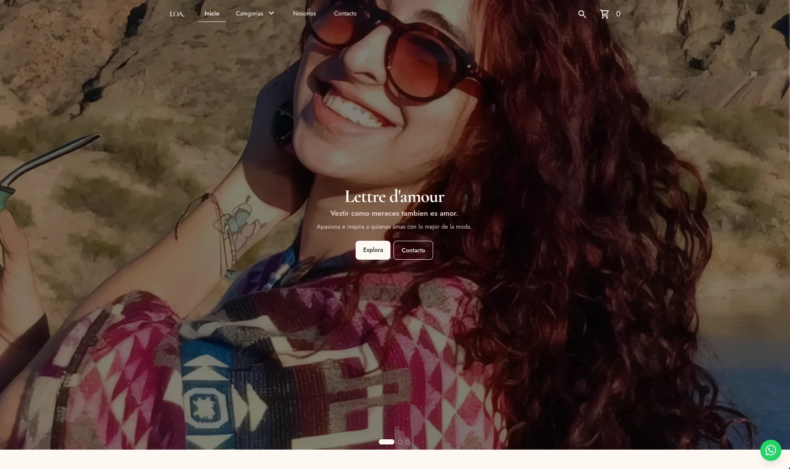
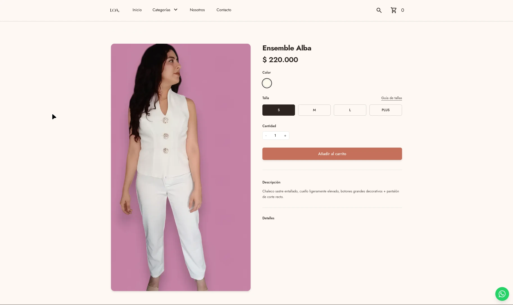
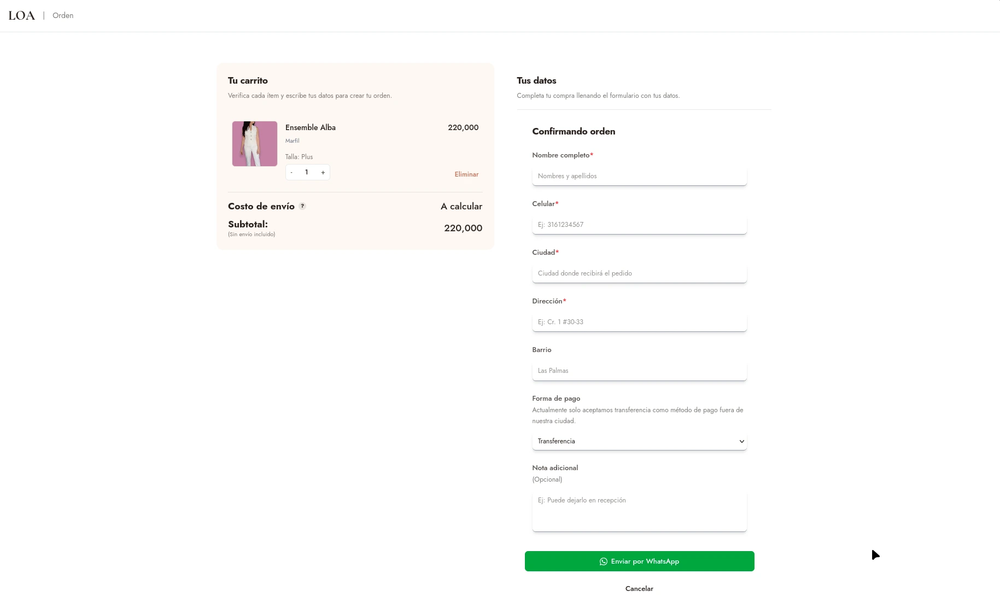
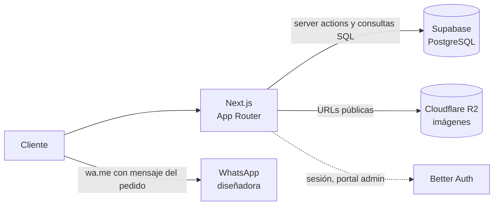
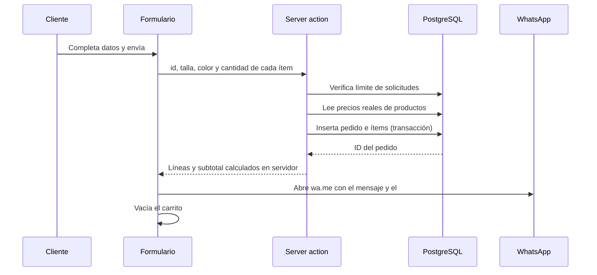

<div align="center">

# LOA — Lucero Ortega Atelier

**E-Commerce para una marca de moda colombiana, con catálogo, carrito y pedidos al instante.**

[](https://semver.org/)
[](https://github.com/strooplab/proyecto-loa.git)
[](LICENSE)

<p align="left">
  
  
  
  
  
  
  
  
</p>

[Ver sitio](#) · [Reportar un problema](../../issues) · [Roadmap](#roadmap)

</div>

---

## Tabla de contenidos

- [LOA — Lucero Ortega Atelier](#loa--lucero-ortega-atelier)
  - [Tabla de contenidos](#tabla-de-contenidos)
  - [Contexto y análisis de negocio](#contexto-y-análisis-de-negocio)
    - [Problema](#problema)
    - [Restricciones que definieron la solución](#restricciones-que-definieron-la-solución)
    - [Objetivo](#objetivo)
  - [Características](#características)
  - [Capturas de pantalla](#capturas-de-pantalla)
  - [Stack tecnológico](#stack-tecnológico)
  - [Arquitectura](#arquitectura)
  - [Decisiones de diseño](#decisiones-de-diseño)
    - [Sistema visual](#sistema-visual)
    - [Datos y consistencia](#datos-y-consistencia)
    - [OJO: Un pedido es una solicitud, no la venta](#ojo-un-pedido-es-una-solicitud-no-la-venta)
  - [Modelo de datos](#modelo-de-datos)
  - [Flujo de checkout](#flujo-de-checkout)
  - [Seguridad](#seguridad)
  - [Instalación](#instalación)
    - [Requisitos](#requisitos)
    - [Pasos](#pasos)
    - [Producción](#producción)
  - [Variables de entorno](#variables-de-entorno)
  - [Estructura del proyecto](#estructura-del-proyecto)
  - [Roadmap](#roadmap)
  - [Autor](#autor)

---

## Contexto y análisis de negocio

LOA es una marca de moda dirigida por la diseñadora Lucero Ortega que vende sus prendas por pedido. Antes de este proyecto, la venta dependía de conversaciones meramente administradas por WhatsApp, sin un catálogo público ni un registro de lo que pedía cada cliente.

### Problema

- El catálogo no estaba centralizado, por lo que cada cliente hacia pedidos por medio de mensajes y capturas.
- No había registro estructurado de pedidos por nombre, contacto, dirección, prendas, talla y color.
- No se tenia un sistema que permitiera o publicitara el envío nacional.

### Restricciones que definieron la solución

| Restricción | Decisión |
| --- | --- |
| La diseñadora ya cierra las ventas por WhatsApp | El checkout no cobra en línea: genera el pedido y abre una conversación con el mensaje armado. |
| No se tenia noción de como se podría manejar envíos nacionales, todo pedido era a nivel local. | La tienda permite mostrar el subtotal "sin envío" y deja que el costo de envío se determine con la diseñadora. |
| Presupuesto y operación pequeños | Servicios gestionados con capa gratuita: Supabase, Cloudflare R2 y Vercel. |
| El catálogo cambia con poca frecuencia | Páginas con caché y revalidación de 1 hora en lugar de renderizado en cada petición. |

### Objetivo

Dar a la marca un catálogo propio y un registro confiable de cada solicitud, sin cambiar la forma en que la diseñadora ya atiende a sus clientes.

---

## Características

- Catálogo por categorías con carrusel de destacados en el landing.
- Páginas de categoría y de producto con variantes de talla y color.
- Carrito persistente en el navegador con Zustand, diferenciados por producto, talla y color.
- Checkout con validación de formulario que genera el pedido y abre WhatsApp con el mensaje listo.
- Registro de cada pedido y sus líneas en la base de datos, con precios calculados en el servidor.
- Límite de solicitudes por IP en checkout y formularios de contacto.
- Navbar adaptable que cambia de estilo según el scroll y la página.
- Sistema de diseño propio con tokens de color y tipografía extraídos del logo de la marca.
- Imágenes servidas desde un bucket Cloudflare R2.

---

## Capturas de pantalla

<div align="center">



</div>

---

## Stack tecnológico

| Capa | Tecnología | Uso |
| --- | --- | --- |
| Framework | Next.js (App Router, Cache Components) | Renderizado, rutas, server actions |
| Lenguaje | TypeScript | Lenguaje tipado de punta a punta |
| UI | React, Headless UI, Swiper | Componentes accesibles y carrusel de productos |
| Estilos | Tailwind CSS | Diseño de estilos |
| Estado | Zustand (`persist`) | Carrito en localStorage |
| Base de datos | Supabase (PostgreSQL) | Catálogo, pedidos, rate limit |
| Cliente de BD | `pg` con pool | Consultas SQL directas (No ORM) |
| Autenticación | Better Auth | Instalado, pero se usará cuando se implemente el portal de administrador |
| Almacenamiento | Cloudflare R2 | Repositorio de imágenes |
| Mensajería | WhatsApp (`wa.me`) | Sistema de checkout |
| Despliegue | Vercel | Hosting |

---

## Arquitectura



- **Lectura del catálogo:** componentes de servidor consultan PostgreSQL directamente y se cachean con `"use cache"` y `cacheLife("hours")`.
- **Escritura de pedidos:** una server action (`crearPedido`) valida, calcula precios y persiste todo en una transacción.
- **Imágenes:** se guarda solo la ruta del objeto en la base; la URL pública de R2 se compone en el cliente.

---

## Decisiones de diseño

### Sistema visual

La paleta y la tipografía se derivan del logo de la marca. Los colores (`espresso`, `cream`, `mocha`, `terracota`, `gold`) viven dentro de la guía de estilos en el `@/app/global.css`, y el logo se renderiza con `mask` para heredar el color del texto, básicamente tratando al logo como un texto, de modo que el mismo SVG funciona sobre fondo transparente, oscuro o crema.

### Datos y consistencia

- **Identidad del ítem del carrito:** `id + talla + color`, centralizada en una sola función (`cartKey`) usada por el store y por las listas de React.
- **Persistencia parcial:** solo `items` se guarda en localStorage, las animaciones o sus estados no.
- **Caché con propagación de errores:** las funciones cacheadas no capturan excepciones, para no congelar un resultado vacío durante horas.

### OJO: Un pedido es una solicitud, no la venta

La tabla `pedidos` guarda precios de lista. El precio final y el envío se negocian por WhatsApp, por lo que `total` significa "lo solicitado" y no "lo cobrado", al final el objetivo principal de la página es enseñar el catálogo al público general, más adelante se tiene planeado implementar un sistema de checkout mas robusto y con menos pasos, pero primero hace falta abrir el negocio al mercado.

---

## Modelo de datos

Tablas principales (resumen):

| Tabla | Propósito |
| --- | --- |
| `categorias` | Categorías activas y su orden |
| `productos` | Catálogo, precio, stock, imágenes, visibilidad |
| `colores`, `tallas` y tablas puente | Variantes por producto |
| `pedidos` | Datos del cliente, subtotal, estado, IP y user agent |
| `pedido_items` | Líneas del pedido con nombre, talla y color como instantánea |
| `rate_limit_hits` | Registro de intentos para el límite de solicitudes |
| Tablas de Better Auth | Usuarios, sesiones y cuentas |

Los pedidos guardan una instantánea del nombre, la talla y el color de cada ítem, de modo que el historial no cambia si el producto se edita o se elimina después.

---

## Flujo de checkout



El cliente nunca envía precios: el servidor los lee de `productos`, de modo que editar el localStorage no altera lo que se registra ni lo que se escribe en el mensaje.

---

## Seguridad

- Precios y subtotales se calculan en el servidor.
- Límite de solicitudes por clave (`tipo:IP`) con bloqueo por transacción para evitar condiciones de carrera.
- Consultas parametrizadas en todo el acceso a la base de datos.
- Variables sensibles sin el prefijo `NEXT_PUBLIC_`.
- Row Level Security habilitado en las tablas de Supabase.
<!-- TODO: confirma con SELECT tablename, rowsecurity FROM pg_tables WHERE schemaname = 'public'; antes de publicar -->
- El proxy redirige `/admin` y `/api/admin` a `/login` sin sesión.

> **Nota:** el proxy solo verifica la presencia de la cookie de sesión. Cuando el portal del administrador esté implementado, cada página y ruta debe validar la sesión en el servidor con Better Auth, impidiendo el traspaso del usuario final a contenido exclusivo del administrador y redireccionandolo a contenido público de libre acceso.

---

## Instalación

### Requisitos

- Node.js 22 o superior
- PostgreSQL local (desarrollo) o un proyecto de Supabase
- Un bucket de Cloudflare R2

### Pasos

```bash
git clone https://github.com/strooplab/proyecto-loa.git
cd proyecto-loa
npm install
cp .env.example .env.local
# el .env.example es un mero esqueleto de las variables que necesitas para que el proyecto funcione, las copias y las pegas en un .env.local y las llenas dependiendo de la tecnología, info o environment que tengas
npm run dev
```

### Producción

```bash
npm run build
npm start
```

---

## Variables de entorno

| Variable | Descripción |
| --- | --- |
| `DB_USER`, `DB_HOST`, `DB_NAME`, `DB_PASSWORD`, `DB_PORT` | Conexión a PostgreSQL local (desarrollo) |
| `SUPABASE_URL` | Cadena de conexión del pooler de Supabase (producción) |
| `BETTER_AUTH_SECRET` | Secreto de Better Auth |
| `BETTER_AUTH_URL` | URL pública del sitio |
| `NEXT_PUBLIC_URL` | URL base pública |
| `R2_ACCOUNT_ID`, `R2_ACCESS_KEY_ID`, `R2_SECRET_ACCESS_KEY`, `R2_BUCKET_NAME` | Credenciales de Cloudflare R2 (repo) |
| `NEXT_PUBLIC_R2_PUBLIC_URL` | URL pública del bucket |
| `NEXT_PUBLIC_WHATSAPP_NUMBER` | Número de WhatsApp de la marca, con indicativo de país |
| `NEXT_PUBLIC_EMAIL`, `NEXT_PUBLIC_ADDRESS`, `NEXT_PUBLIC_NUMBER` | Datos de contacto mostrados en el sitio |

---

## Estructura del proyecto

```
src/
├── app/
│   ├── (public)/        # Landing, categorías, producto, contacto, nosotros
│   ├── (admin)/         # Portal de administración (en construcción)
│   ├── (auth)/          # Login (en construcción)
│   ├── api/             # Rutas públicas, admin y rate limit
│   └── checkout/        # Sistema de checkout form que envía a WhatsApp
├── actions/             # Server actions (crearPedido, verificarContacto)
├── components/          # UI, secciones y servicios de componentes
├── services/            # Consultas a la base de datos
├── store/               # Carrito con persistencia local
├── lib/                 # Conexión a BD, rate limit, auth
├── types/               # Tipos
└── utils/               # Utilidades (cartKey, formatPrice, WhatsApp)
```

---

## Roadmap

- [x] Catálogo, categorías y páginas de producto
- [x] Carrito persistente y checkout por WhatsApp
- [x] Registro de pedidos en Supabase
- [x] Límite de solicitudes por IP
- [ ] Portal de administración (productos, categorías, pedidos, testimonios)
- [ ] Autenticación con Better Auth en el portal
- [ ] Versión 1.0.0 al completar el portal

---

## Autor

**Juan Diego García Ortega**
Ingeniero Multimedia — Universidad de San Buenaventura de Cartagena

[GitHub](https://github.com/strooplab) · [LinkedIn](https://www.linkedin.com/in/juan-diego-garcia-ortega) · [Portafolio](https://stroopdev.vercel.app)

---

<div align="center">
Hecho para <strong>Lucero Ortega Atelier</strong>
</div>